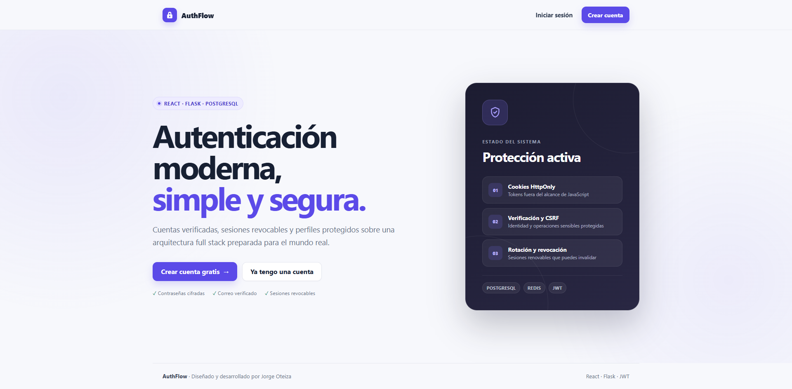
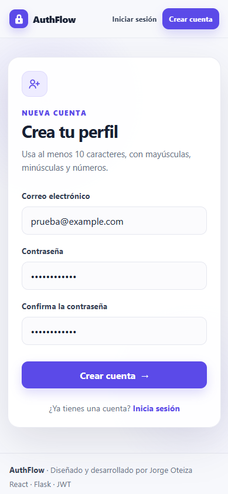
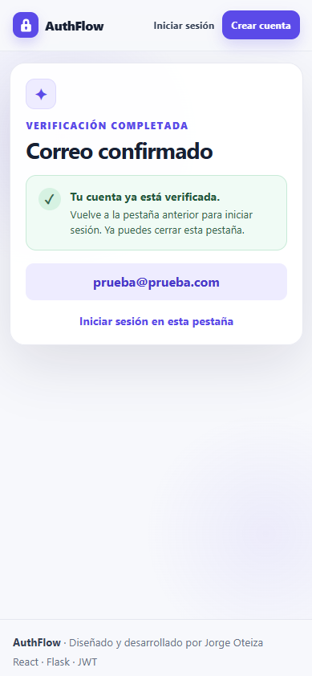
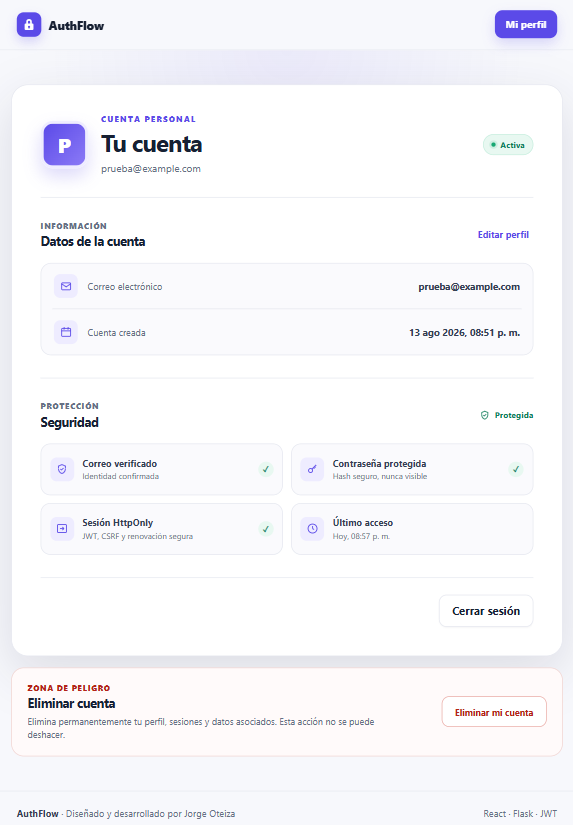
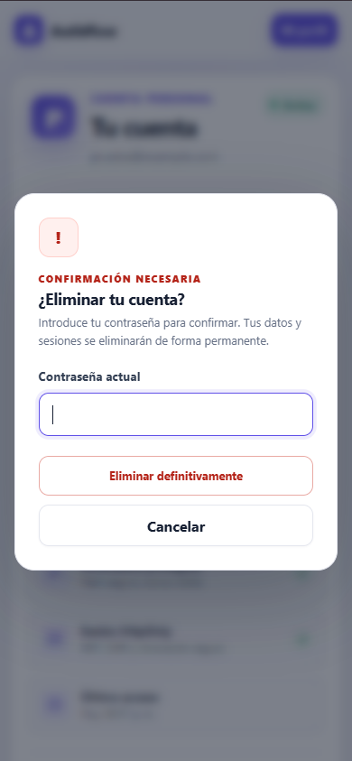
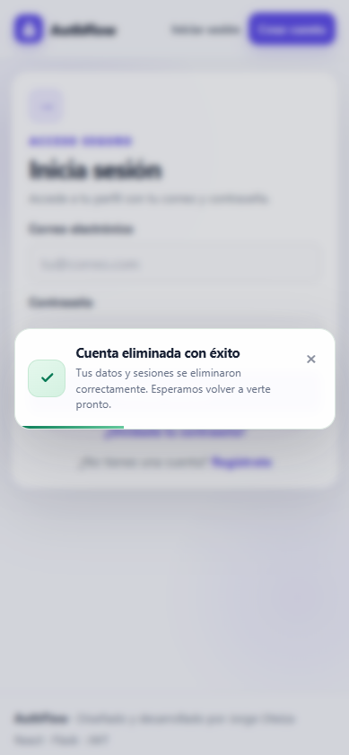

# AuthFlow · React + Flask

Aplicación full stack de autenticación que demuestra un flujo seguro de registro, inicio de sesión y gestión de cuenta con React, Flask y JWT.

## Origen

AuthFlow comenzó durante un bootcamp de desarrollo full stack utilizando un starter educativo. Desde entonces ha sido ampliado, modernizado y mantenido por [Jorge Oteiza](https://github.com/JorgeOteiza). Actualmente es un repositorio independiente con arquitectura, interfaz, seguridad, pruebas y despliegue propios.

## Vista previa



La interfaz presenta el estado de seguridad sin ocultar la experiencia de producto y se adapta a escritorio, tablet y móvil.

## Recorrido visual

<table>
  <tr>
    <td width="33%" align="center">
      
      <br /><strong>Registro responsive</strong>
    </td>
    <td width="33%" align="center">
      
      <br /><strong>Verificación de correo</strong>
    </td>
    <td width="33%" align="center">
      
      <br /><strong>Cuenta y seguridad</strong>
    </td>
  </tr>
</table>

<table>
  <tr>
    <td width="50%" align="center">
      
      <br /><strong>Confirmación sensible</strong>
    </td>
    <td width="50%" align="center">
      
      <br /><strong>Resultado confirmado</strong>
    </td>
  </tr>
</table>

## Características

- Registro con normalización de correo y validación de contraseña.
- Inicio de sesión limitado contra ataques de fuerza bruta.
- Contraseñas almacenadas exclusivamente mediante hash.
- Access tokens de 15 minutos y refresh tokens de 7 días.
- Rotación de refresh tokens e invalidación global de sesiones al cerrar sesión.
- Tokens almacenados en cookies `HttpOnly`, `Secure` en producción y `SameSite=Lax`.
- Protección CSRF mediante double-submit cookies.
- Restauración y renovación automática de sesión.
- Perfil privado sin IDs controlados por el cliente.
- Cambio de correo y contraseña verificando la contraseña actual.
- Eliminación segura de la propia cuenta.
- Respuestas de error estructuradas sin filtrar información interna.
- Migraciones de base de datos y pruebas automatizadas.
- Verificación de correo y recuperación de contraseña mediante tokens de un solo uso.
- Comprobación opcional de contraseñas filtradas mediante k-anonymity.
- Auditoría de eventos de seguridad y Redis para rate limiting en producción.
- Integración continua y despliegue preparado para Render.

## Tecnologías

- React 19, React Router y Context API.
- Flask, Flask-JWT-Extended y Flask-Limiter.
- SQLAlchemy, Alembic y PostgreSQL.
- Redis para rate limiting compartido.
- Webpack 5.
- Pytest, Vitest, Playwright y GitHub Actions.
- Docker Compose para la infraestructura local.

## Instalación local

Requisitos: Python 3.12+, Node.js 24, npm y Docker Desktop. PostgreSQL y Redis se ejecutan con Docker Compose; SMTP es obligatorio únicamente en producción.

```bash
git clone https://github.com/JorgeOteiza/authflow-react-flask.git
cd authflow-react-flask
python -m venv .venv
```

Activa el entorno virtual, instala las dependencias y crea la configuración local:

```bash
python -m pip install -r requirements-dev.txt
npm ci
cp .env.example .env
```

Genera valores aleatorios diferentes, de al menos 32 bytes, para `SECRET_KEY` y `JWT_SECRET_KEY`. Configura también `DATABASE_URL`. El `.env.example` documenta SMTP, Redis y la política de contraseñas. En desarrollo, `EMAIL_DELIVERY=log` imprime los enlaces de correo en la consola de Flask.

Inicia PostgreSQL y Redis, aplica las migraciones e inicia la API:

```bash
docker compose up -d
docker compose ps
flask --app src/app.py db upgrade
flask run
```

En otra terminal, inicia React:

```bash
npm run dev
```

Frontend: `http://localhost:3000` · API: `http://localhost:3001`

Detén la infraestructura al terminar con `docker compose stop`. Los datos permanecen en volúmenes Docker. Usa
`docker compose down` para eliminar contenedores y red sin borrar datos; `docker compose down -v` también elimina
las bases locales y debe utilizarse únicamente cuando quieras reiniciarlas desde cero.

Usa siempre `localhost` en ambas direcciones durante el desarrollo. No mezcles
`localhost` con `127.0.0.1`: las cookies seguras y la política CORS distinguen
ambos hosts.

## Comandos de verificación

```bash
pytest
npm test
npm run test:e2e
npm audit
npm run build
```

Las pruebas E2E usan servicios temporales en los puertos 3100/3101 y cubren escritorio, iPhone 12 Pro y Galaxy. Instala Chromium una vez con `npx playwright install chromium`.

La API entrega timestamps UTC con sufijo `Z` y el navegador los convierte a la zona horaria local. Para limpiar tokens expirados y eventos con más de 90 días ejecuta `flask --app src/app.py purge-security-records`.

## API

El contrato completo y los ejemplos se encuentran en [docs/API.md](docs/API.md). Los endpoints principales son:

| Método | Ruta | Uso |
| --- | --- | --- |
| `POST` | `/api/auth/signup` | Crear una cuenta |
| `POST` | `/api/auth/login` | Iniciar sesión |
| `POST` | `/api/auth/refresh` | Renovar la sesión |
| `POST` | `/api/auth/logout` | Cerrar la sesión |
| `POST` | `/api/auth/verify-email` | Verificar el correo |
| `POST` | `/api/auth/forgot-password` | Solicitar recuperación |
| `POST` | `/api/auth/reset-password` | Restablecer contraseña |
| `GET` | `/api/me` | Consultar el perfil actual |
| `PUT` | `/api/me` | Actualizar la propia cuenta |
| `DELETE` | `/api/me` | Eliminar la propia cuenta |
| `GET` | `/api/health` | Comprobar el servicio |

## Estructura

```text
src/
|-- api/          # API, modelo, validación y extensiones Flask
|-- front/        # Aplicación React
|-- app.py        # Application factory y configuración
`-- wsgi.py       # Entrada del servidor WSGI
migrations/       # Historial de esquema
tests/            # Pruebas de integración de la API
```

## Autor

Desarrollado y mantenido por [Jorge Oteiza](https://github.com/JorgeOteiza).
